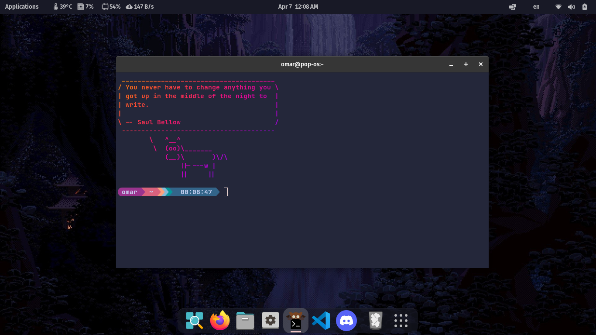

# omar-configs


 


### Gnome theme:
[Catppuccin](https://github.com/catppuccin/catppuccin) theme with Macchiato Peach

### Terminal and shell :
[Kitty](https://github.com/kovidgoyal/kitty) with zsh and [Ohmyzsh](https://ohmyz.sh/)

#### Installation:

For Ubuntu and debian based systems:
```
sudo apt install zsh
```

For Fedora
```
sudo dnf install zsh
```

For Arch
```
pacman -S zsh
```

To set zsh as the default shell use 
```
chsh -s /usr/bin/zsh (hostname)
```

Lastly, To apply the theme simply copy the files in this repo while keeping in mind to change the path in different files to ```
/home/usr/(your user)``` 